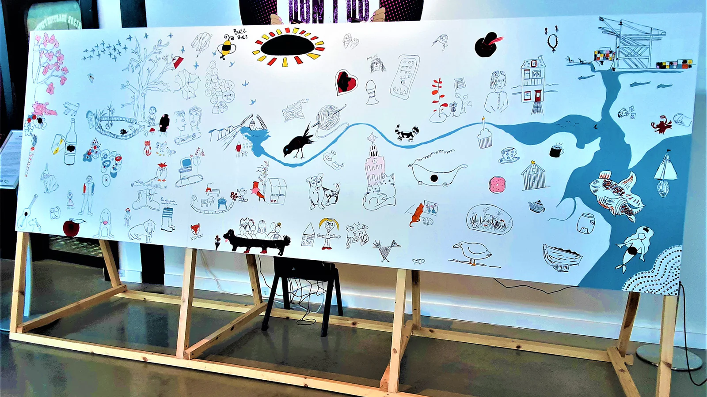
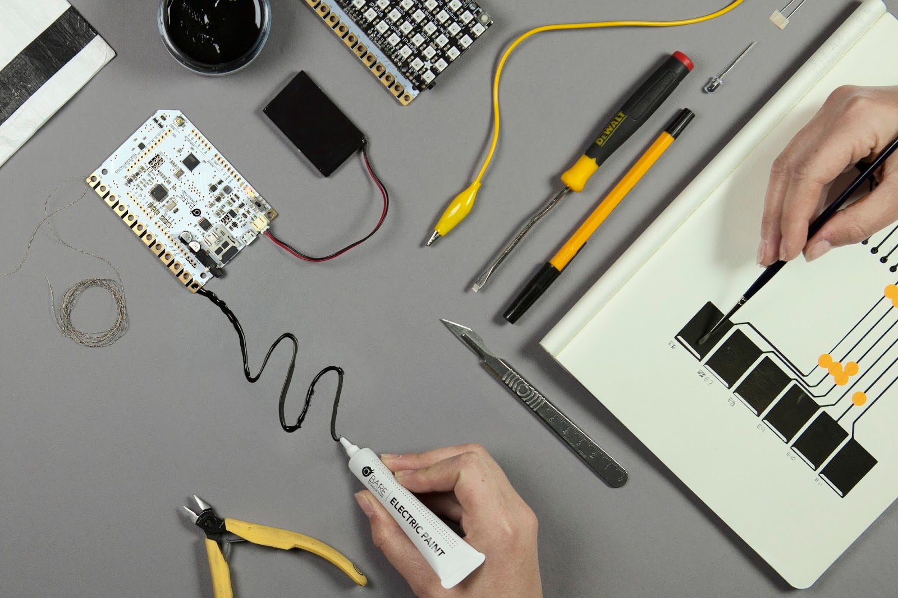
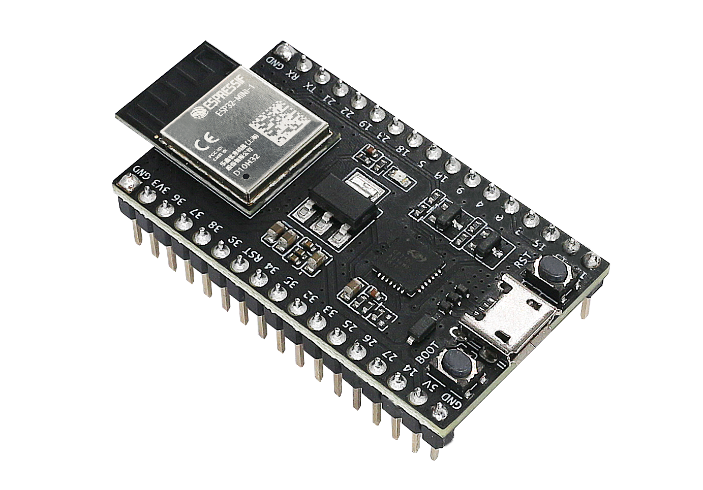
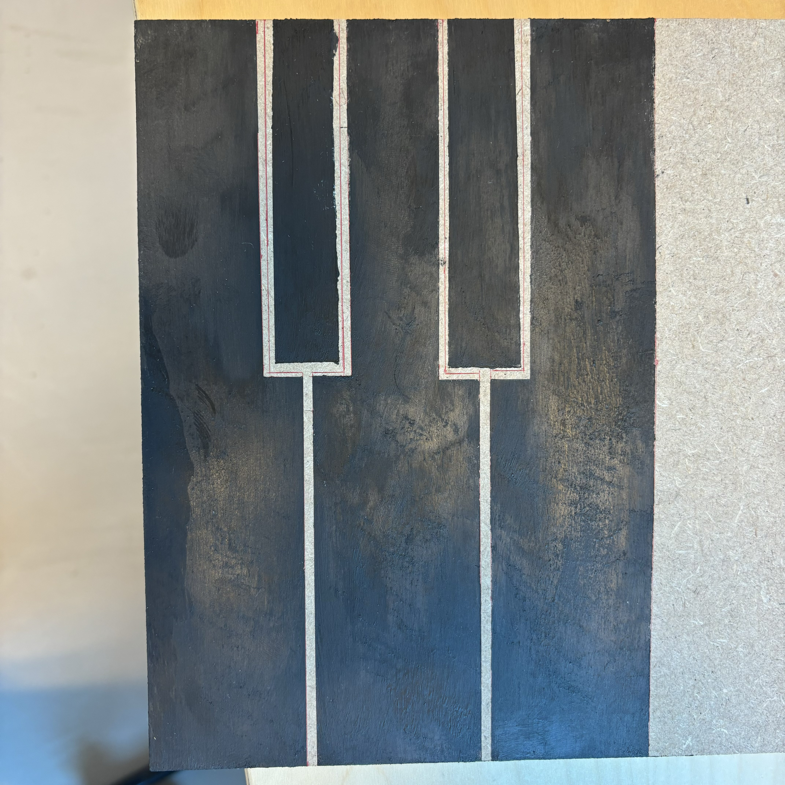
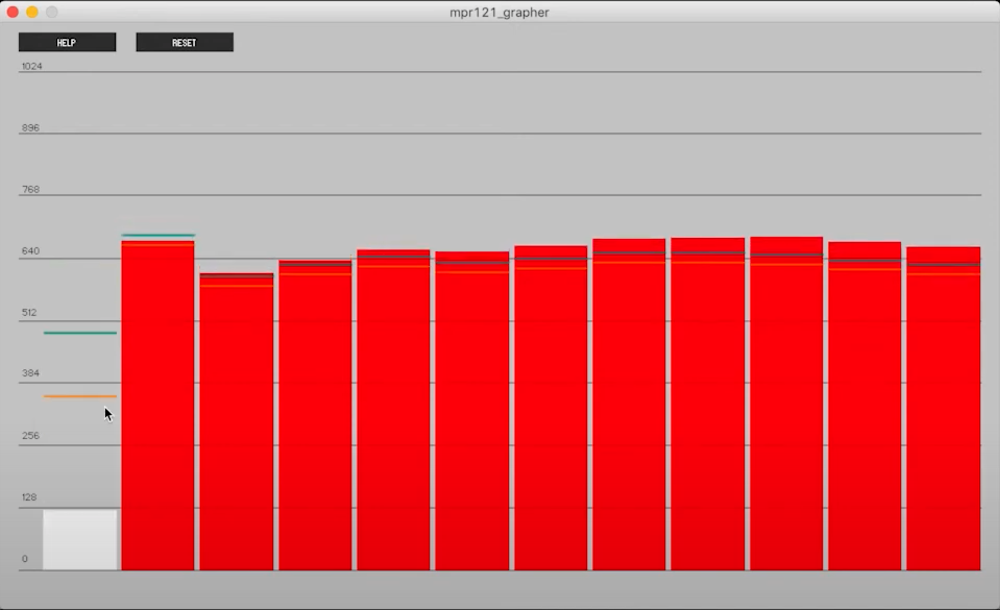

# Interactive Wall

## About
Welcome to the Interactive Wall project!  
This project was created as part of the Project Experience course at [VIVES University of Applied Sciences](https://www.vives.be/en).  
The goal of this project was to create a Proof of Concept interactive wall that can play music when touching the board on certain places.   
## What is the interactive wall?  
The interactive wall is a wall with tiles that are touch sensitive using the capacitive touch sensors available on the Bare Conductive Touch board and the ESP32. Each tile has its own output sound that comes from a speaker. The sounds can change based on what you desire.

## The Team
[Luca De Clerck](https://github.com/LucaClrk)  
[Simon Haesaert](https://github.com/simonJIM)  
[William Rogov](https://github.com/Rwill03)  
[Xander De Smet](https://github.com/Sha88y)  

## Table of content
- [Interactive Wall](#interactive-wall)
  - [About](#about)
  - [What is the interactive wall?](#what-is-the-interactive-wall)
  - [The Team](#the-team)
  - [Table of content](#table-of-content)
  - [Introduction](#introduction)
  - [Description](#description)
  - [How it works](#how-it-works)
    - [Panel](#panel)
    - [Audio](#audio)
    - [Image](#image)
  - [Bare Conductive Touch board](#bare-conductive-touch-board)
  - [The ESP32](#the-esp32)
  - [Installation and Usage](#installation-and-usage)
    - [Bare Conductive Touch board](#bare-conductive-touch-board-1)
    - [ESP32](#esp32)
  - [Software](#software)
    - [Grapher](#grapher)
  - [Hardware](#hardware)
  - [Project State](#project-state)
  - [Team members and Roles](#team-members-and-roles)
  - [Future Improvements](#future-improvements)
  - [Sources](#sources)

##  Introduction 
This is the READ.ME of the project  "Interactive Wall" which was created as a part of the coursework. This will contain information about the project, the requirements, the software used and the hardware implemented. It will also go over the team-members and their diverse roles in the project.

## Description
The interactive wall is a wall with tiles that are touch sensitive using the capacitive touch sensors available on the Bare Conductive Touch board and the ESP32. Each tile has its own output sound that comes from a speaker. The project contains a Animal-soundbord and a Piano-soundbord. The Bare Conductive Touch board is a capacitive touch sensing board that can be used to turn any conductive material into a touch sensor. The board can be programmed to output different sounds when the electrodes are touched. The board can be programmed using the Arduino IDE. The ESP32 microcontroller, we have chosen this microcontroller for its robust programming possibilities and fast processing speed, it has capacitive touch sensors and interfaces seamlessly with an MP3 player module that we need for this project. This combination enables efficient multitasking, versatile connectivity, and intuitive user interaction, making it ideal for our project. The ESP32 will give us more possibilities to improve our project. It will be easier to program and will open more options to us.

## How it works
Each board has a microcontroller that will perform the tasks to make the soundboard work. The board can detecte "touch" thanks to the conductive paint, which is included in the Touch Board Starter Kit. The paint helps us to achive a sense of "interactiveness" , because the "touch" is not registered with a traditional button. This contributes to the premise of this project. 
### Panel
The panel is made from wood and will be used to put the image on. It is quite a large board at 200x120cm. so We will paint the panel with conductive paint and put the image above it. So when someone touches the images on the right spot, you will make contact with the paint. There is a screw in the middle of each painted spot. This screw comes out at the backside and will make it possible to connect the panel with our microcontroller. Because of these screws we can wrap a copper wire around it and connect it to the microcontroller.

### Audio
The audio will be played through a speaker. The speaker will be connected to the microcontroller. So when contact is made the sounds will play through the speaker. We have a micro-SD card which we will put MP3 sounds on. This way we can choose the sounds we play and the length of them.

NOTE: The order you copy the mp3 into micro SD card will affect the order mp3 played , which means play(1) function will play the first mp3 copied into micro SD card. This is only applicable for the ESP powered bord.

### Image
The image was printed through the webshop [Printshopz](https://www.printshopz.be/). We made it 200x120cm so it will fit the panel. The image will be put on the panel and will be used to make contact with the conductive paint. On the image there will be certain parts that will play a sound when touched. One of the images will be a farm, on this image there are multiple animals. So lets say there is a cow, when you touch the cow, you will make contact with the paint underneath it and the sound of a cow will play. 
## Bare Conductive Touch board
The Bare Conductive Touch board is a capacitive touch sensing board that can be used to turn any conductive material into a touch sensor. The board can be programmed to output different sounds when the electrodes are touched. The board can be programmed using the Arduino IDE.

The working of the microcontroller was secretive and not transparent, so we decided to reverse-engineer the controller. The research can be found in the folder "docs", named as "Research Bare Conductive Microcontroller".

We will use this board to make our project. With connectors we will connect the images on our board with the touch board. When the images are touched, the board will output a sound.

## The ESP32  
The ESP32 microcontroller, we have chosen this microcontroller for its robust programming possibilities and fast processing speed, it has capacitive touch sensors and interfaces seamlessly with an MP3 player module that we need for this project. 

This combination enables efficient multitasking, versatile connectivity, and intuitive user interaction, making it ideal for our project. 
The ESP32 will give us more possibilities to improve our project. It will be easier to program and will open more options to us.

## Installation and Usage
### Bare Conductive Touch board
Using the Bare Conductive Touch Board is very easy. You can use it straight out of the box. Just plug it in and you are ready to go. You can choose the sounds you want to play using the SD-card. The sounds will then play when the electrodes are touched. 

To select new sounds or to switch which sounds play when a electrodes is touched, it is important to name the sounds correctly, for example: if you want that a sound will play if you touch electrode 1, then you will have to name the sounds "000". For electrode 2 "001" etc...

### ESP32
The ESP32 will be harder to use, but gives us more versatility. To use the ESP32, you will first need to load the program we coded into it. You can do this by using the IDE or software program you choose. You will also need to connect the ESP32 to the MP3 player module. This will allow you to play sounds when the electrodes are touched. Lucky for you we chose for the DFRobotMiniPlayer which has a library making it easier to use and code. When the ESP32 is connected to the MP3 player module, you can connect the speaker to the MP3 player module. This will allow you to play sounds when the electrodes are touched. 

### The Piano

For the second board, we used the ESP32 as the microcontroller for controlling the piano. The piano consist of 5 keys and a seperate button. The seperate button is used to change the type of instrument. With this setup, it is simple to reproduce and replace the board and/or the sounds.

## Software
We will use PlatformIO to program the ESP32. This is an easy alternative to Arduino IDE and has all the libraries you possibly need. The Ardiuno EDI is used for the programming of the bare conductive microcontrols as it is recommended.

### Grapher

Grapher is a free software that is recommended by Bare Condcutive© for visualising the data. The grapher is a simple C++ program that "graphicaly" represent the data received from the pins of the Bare conductive microcontroller.

In this diagram, is pin 1 pressed.

Grapher is especially handy for the debugging process, because it visualisize the incoming data from the touch sensor in real time, which saves quite a bit of time.

## Hardware
For hardware the microcontroller will be used (both the Bare Conductive and the ESP32). We also use a AC/DC Power adapter to supply our microcontroller and speaker. They both work on 5V. 

## Project State
The project is currently in the development phase. The first board is finsihed (in the sofware side, as in the hardware side). The second board is nearly finished. 

## Team members and Roles
- Luca De Clerck: Scrum Master
- Simon Haesaert: Team member
- William Rogov: Team member
- Xander De Smet: Team member

## Future Improvements
/

## Sources
[bareconductive.com](https://www.bareconductive.com/)
